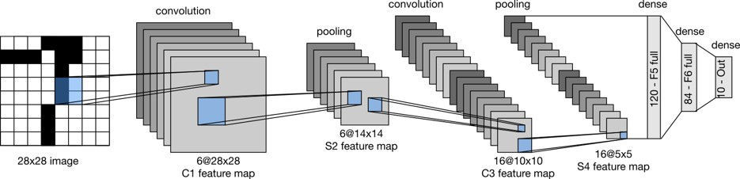
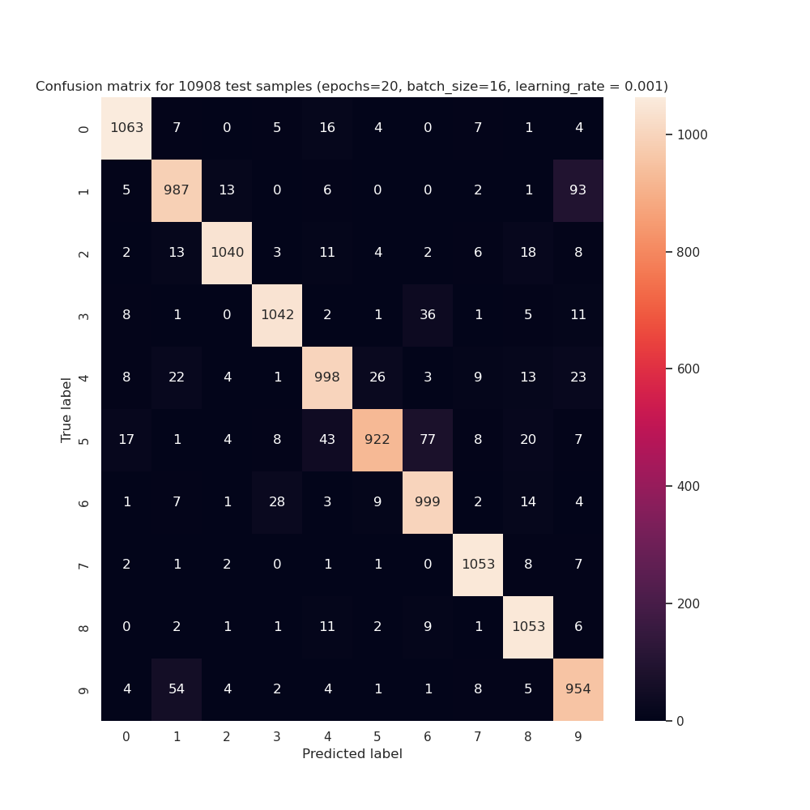

# Bangla Digit Recognition Challenge

<br/>

## **Dataset**
<br/>

[Numta Handwritten Bengali Digits](https://drive.google.com/drive/folders/1iaLxuSN88OyOuHwEbwBzfmwf9gFi_Vqn?usp=share_link)

<br/>

There are two folders in the above dataset -

- **NumtaDB_with_aug** : It contains some ***training*** and ***testing*** folders ans some ***csv*** files containing ***labels*** for each image. But the **csv** files are only available for ***training*** folders. 
<br/>

```training-a```, ```training-b```, ```training-c``` is combined for training purpose and ```training-d``` is used for testing purpose. ```training-e``` is omitted as it contains unusual images.

- **Toy Dataset** : It contains one dimensional array representing digits. The purpose of this dataset is to verify whether the backpropagation is working properly or not.

<br/>

## **Data Preprocessing**

<br/>

For each training folder, prepare a numpy array of images. Python's **```pillow```** package is used for this task. Steps are mentioned below:

- The images have three channels or dimensions. As we need to recognize digits, two dimensional grayscale images are enough. So, we convert the images to grayscale.

- Inverting the image is necessary as the background is white and the digits are black. So, we invert the image.

- Dilating the image

- Resizing the image to 28x28

- Saving the image as numpy array to npy file

<br/>

THe following code is used for preprocessing:

<br/>

```python
list_dir = sorted(os.listdir(image_dir))

for i, img_file in enumerate(list_dir):

    if not img_file.endswith(('.png', '.jpg', '.jpeg')):
        continue
    
    img = Image.open(os.path.join(image_dir, img_file))
    img = ImageOps.grayscale(img) # convert to grayscale

    img = ImageOps.invert(img)  # invert image
    img = img.filter(ImageFilter.MaxFilter(3))  # dilate image
    img = img.resize((28, 28))  # resize to 28x28

    img = np.array(img)  # convert to numpy array
```

<br/>

After the above process, ```training-a.npy```, ```training-b.npy```, ```training-c.npy```, ```training-d.npy``` are created.

<br/>

Now, we need to map the labels to the images. The labels are stored in csv files. The following code is used for this task:

<br/>

```python
def load_labels(filename):

    images_data = np.load(f'Nonnormalized/{filename}.npy', allow_pickle=True)
    df = pd.read_csv(f'Datasets/NumtaDB_with_aug/{filename}.csv')

    labels = df['digit'].values

    print(images_data.shape, labels.shape)
    np.save(f'Nonnormalized/{filename}_labels.npy', np.array(list(zip(images_data, labels))))
```

<br/>

After the above process, ```training-a_labels.npy```, ```training-b_labels.npy```, ```training-c_labels.npy```, ```training-d_labels.npy``` are created.

<br/><br/>

## **Model**
<br/>

**```LeNet```** model is used to classify the digits. 
<br/><br/>

<p align="center">
   
</p>

<br/>
The following code is used to build the model:

<br/>

```python

def build_model():

    num_output_units = 10
    num_input_channels = 1

    model = Sequential(batch_size=16, num_epochs=1, verbose=True)
    model.set_parameters(num_input_channels=num_input_channels, num_output_units=num_output_units, 
                image_h=28, image_w=28)
    

    convolution1 = Convolution(num_output_channels=6, kernel_dim=(5, 5), padding=2, stride=1, learning_rate=0.001)
    convolution1.set_parameters(conv1_filters, conv1_bias)
    
    model.add(convolution1)

    model.add(Relu())
    model.add(MaxPooling(kernel_dim=(2, 2), padding=0, stride=2))

    convolution2 = Convolution(num_output_channels=16, kernel_dim=(5, 5), padding=0, stride=1, learning_rate=0.001)
    convolution2.set_parameters(conv2_filters, conv2_bias)

    model.add(convolution2)

    model.add(Relu())
    model.add(MaxPooling(kernel_dim=(2, 2), padding=0, stride=2))

    model.add(Flatten())

    fc1 = FullyConnected(num_output_units=120, learning_rate=0.001)
    fc1.set_parameters(fc1_filters, fc1_bias)
    model.add(fc1)

    fc2 = FullyConnected(num_output_units=84, learning_rate=0.001)
    fc2.set_parameters(fc2_filters, fc2_bias)
    model.add(fc2)

    fc3 = FullyConnected(num_output_units=num_output_units, learning_rate=0.001)
    fc3.set_parameters(fc3_filters, fc3_bias)
    model.add(fc3)

    model.add(Softmax(num_output_units=num_output_units))
    
    return model
```

<br/><br/>

## **Training**

<br/>

Training data from ```training-a```, ```training-b```, ```training-c``` are combined and shuffled. Then, the data is split into 90% training and 10% validation data. The model is trained for 10 epochs. After each epoch, validation accuracy is calculated. 

<br/>

After training, the model is saved as ```pkl``` file. The following code is used to save the model:

<br/>

```python
def save_model(model, filename):

    with open(filename, 'wb') as f:
        pickle.dump(model, f)
```
<br/>

Run the following command to train the model:

<br/>

```bash
python3 train.py
```

<br/>

You will get a ```confusion matrix``` like this:
<br/><br/>

<p align="center">
   
</p>


<br/><br/>

## **Testing**
<br/>

The model is tested on ```training-d``` data. At first, the model is loaded from ```pkl``` file. The following code is used to load the model:

<br/>

```python
with open('filename.pkl', 'rb') as f:
    conv1_filters, conv1_bias, \
    conv2_filters, conv2_bias, \
    fc1_filters, fc1_bias, \
    fc2_filters, fc2_bias, \
    fc3_filters, fc3_bias = pickle.load(f)
```

<br/>

**Run** the model on the test data and calculate the accuracy. The following command is used to test the model:

<br/>

```bash
python3 test.py 'Datasets/NumtaDB_with_aug/training-d'
```

<br/>


